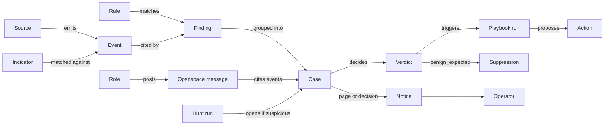

# Ontology

Every noun the kernel stores or passes between capabilities: what it means,
where it lives, its states, and what it connects to. Names match the code. When
another document uses a term differently, this file and the schema win.

Every table below carries `tenant_id`, and row-level security scopes it
(migrations 007, 009 and 026): a session that has not set `shoc.tenant_id` sees none of it. Schema as of migration 049.

## The main path

Every arrow is a capability call, and every capability call lands in the audit
log.

## 1. Tenancy and access

| Term | Lives in | Meaning | Values |
|---|---|---|---|
| Tenant | `shoc.tenants` | One company using shoc. Owns every other row and names its event-store backend and schema. | backend: `postgres` (default), `databricks`, `snowflake`, `redshift`, `bigquery` |
| Capability | `shoc/capabilities/registry.py` | One typed operation: input and output dataclasses, a scope, an autonomy level, the principals allowed to call it. REST, MCP, CLI and Slack are generated from it. See [reference.md](reference.md). | |
| Principal | `Caller.kind` | The kind of caller. Crew roles run as `agent`, an assistant over MCP as `external_agent`, workers and connectors as `service`. | `human`, `agent`, `external_agent`, `service` |
| Scope | `Caller.scopes` | A permission string `area:verb`, such as `cases:read` or `actions:approve`. `*` holds all, `cases:*` every verb in an area, `*:read` every read. `permits()` checks principal, then scope, then autonomy. | |
| Role | `ROLES` in `shoc/api/auth.py` | A named set of scopes for the person behind a token (`role` in `token.create` or `SHOC_TOKENS`), an account (`user.invite`, `user.update`) or the `shoc mcp` stdio client (`SHOC_MCP_ROLE`). Every role is a human principal; an L2 call over MCP waits for the person's confirmation (RFC 0018). Without a role, an MCP client is an external agent. | `admin`, `operator`, `deployer`, `reader` |
| Token | `shoc.api_tokens`, `SHOC_TOKENS` | A bearer credential for one person, with a role, or one machine, with a kind and scopes, on one tenant. `token.create` shows it once and keeps its SHA-256; `token.revoke` ends it on the next request. The first one issued, or the first account, ends single-user mode for good (RFC 0019, RFC 0028). | `tok_…` ids; live, expired, revoked |
| Account | `shoc.users` | A person who signs in to the console: an email unique within the tenant, a role, and either a password with an authenticator or an SSO issuer and subject. Comes from `user.invite`, or joins as `reader` on a first SSO sign-in in a configured domain. Five wrong codes lock it for 15 minutes, doubling up to a day. It is never deleted; `user.update` disables it, which ends its sessions, its links and the role tokens issued to its email (RFC 0028). | `usr_…` ids; invited, active, disabled |
| Link | `shoc.user_links` | An invitation or reset link, kept as its SHA-256 and carried in the console's `/welcome#…` address. An enrolling link (`user.invite` for 7 days, `user.reset` for 1 day) sets a new password and a new authenticator; one from "Forgot password" keeps the authenticator. A new link ends the person's earlier ones, accepting one ends their sessions, and five wrong codes end it. | open, used, expired |
| Session | `shoc.api_tokens` | A token row tied to an account by `user_id`, held by a signed-in browser in an HttpOnly cookie. It has no role of its own and takes the account's on every request. It lasts 12 hours, and signing out, accepting a link or disabling the account revokes it. A person's token can also be the session, through `POST /auth/token`, for up to 12 hours, or until the token ends if sooner; signing out clears that cookie and leaves the token live until `token.revoke`. | `tok_…` ids; live, expired, revoked |
| SSO provider | `shoc.sso_providers` | The company's OpenID Connect provider: its issuer, client id, the endpoints read from its discovery document, the domains it signs people in for, and the client secret, sealed. One per tenant, set by an admin with `sso.configure`. | `oidc` |
| Autonomy level | `content/policy.yaml` | How far an operation may go without a person. L0 reads, L1 acts reversibly on its own, L2 needs a human approval. Each principal has a ceiling. | `external_agent` L0, `agent` L1, `service` L1, `human` L2 |
| Audit entry | `shoc.audit_log` | One capability call, or one change of an action's state: principal, capability, time, hashes of input and output, error. Each row carries an HMAC, keyed from `SHOC_MASTER_KEY`, over the previous row's hash and its own fields (SEC-1). | `action.proposed`, `action.approved`, `action.rejected`, `action.started`, `action.executed`, `action.rolled_back`, `audit.checkpoint`, or a capability name |

## 2. Data

| Term | Lives in | Meaning | Values |
|---|---|---|---|
| Source | `shoc.connector_config`, `connector_state` | One product that sends logs, pulled by a connector on an interval (300 s default). Credentials are encrypted in `secret`. 24 connectors ship (23 products and `file`); see [connectors.md](connectors.md). | |
| Onboarding | `shoc.source_onboarding` | The Integrator's progress on one source. A source is done when it has produced a finding (`proof_finding`). `dark` marks a source that stopped sending. | `discover` → `credentials` → `map` → `prove` → `done` |
| Event | `ocsf_events` via an `EventStore` adapter | One log record mapped to OCSF, with the whole original event kept, technology-specific fields included. `event_uid` is what every citation points at. Event content is untrusted data. | |
| Entity | typed key | A thing an event is about, written `kind:value` (`user:alice@example.com`, `ip:203.0.113.7`). Findings, cases, graph nodes and exposures share these keys. | `user`, `key`, `ip`, `resource`, `account`, `host`, `device`, `role`; on a finding only, `process_hash`, `file_hash` |
| Graph node, graph edge | `shoc.graph_nodes`, `graph_edges` | Entities seen in events, and pairs seen together, with counts and first and last seen. Code groups a cycle's findings by shared entity (`engine.open_for_findings`), then Sentinel attaches a finding to an open case it shares a graph path or a campaign with. | edge kind: `observed_with` |

## 3. Detection

| Term | Lives in | Meaning | Values |
|---|---|---|---|
| Rule | `content/rules/*.yaml`, `shoc.rule_state` | A Sigma-subset detection over OCSF fields, with severity, confidence, ATT&CK techniques and the field that names its entity. Has a positive and a negative fixture and one playbook. 182 ship. `rule_state` also holds the indicator matcher's watermark, as `ioc_match`. | status: `stable`, … |
| Finding | `shoc.findings` | One rule matching one entity in one window, with the matched `event_uids`. Unique per tenant, rule, entity and window start. A finding that is only shoc's own credential at work is kept as `self` and opens no case (D78); one a live suppression covers is kept as `suppressed`. A finding in a case follows it: `triage` while the case is open, then `false_positive` if the case closed on that verdict and `closed` on any other (D136). | status: `new`, `triage`, `closed`, `false_positive`, `self`, `suppressed`, `deferred` |
| Suppression | `shoc.suppressions` | One rule silenced for one entity because a case was closed `benign_expected`, for 7 days at most; a repeat never extends it and an operator's account is never suppressed (D77). Revoked when its case reopens. | `active`, `expired`, `revoked` |
| Detection backlog item | `shoc.detection_backlog` | Work for the Detection Engineer: a case closed `false_positive`, a benign closure that came back, a rule over its volume, a technique intel named (with what the report saw the attacker do), a hunt that found confirmed attacks (D77). A closed item keeps who decided and why; a person must give the reason (D132). A read returns its context: what reports said, the logs that would show it and whether we receive them, the rules, packs and cases near it (D133). | kind: `defect`, `promote`, `coverage`; intake: `case`, `hunt`, `cti`, `health`, `posture`, `human`; state: `open`, `rejected`, `done` |
| Merged rule | `shoc.merged_rules` | A new rule merged at runtime with its playbook id, fixtures and backtest, or `{narrows, exclude}`: an exclusion composed onto a shipped rule, lapsing after 90 days (D77). `shoc.rule_proposals` is no longer written. | `merged`, `reverted`, `lapsed` |
| Merged hunt pack | `shoc.merged_hunts` | A pack the Hunter wrote for a backlog item, with its fixtures and what the gate saw over the tenant's data; it runs with the shipped packs (RFC 0032). | `merged`, `reverted` |

## 4. Cases and crew

| Term | Lives in | Meaning | Values |
|---|---|---|---|
| Case | `shoc.cases`, `case_entities` | One investigation: findings about related entities, a severity, a state, a verdict, a confidence. States follow NIST 800-61. Any state may jump to `closed`; a closed case reopens into `triage`. A finding never joins a closed case: it opens a new one that names it (`related_case_uid`), and `closed_by` says whether a person closed it (D78). | `triage` → `analysis` → `containment` → `eradication` → `recovery` → `post_incident` → `closed` |
| Verdict | `cases.verdict` | What the case is. A role picks one of four dispositions. `needs_human` is reached only when there is no model, the model failed, or citations did not survive verification; no role can pick it (RFC 0012). | `malicious`, `suspicious`, `benign_expected`, `false_positive`, `needs_human` (default before a verdict: `unknown`) |
| Role | `shoc/agents/roles.py` | A crew member: a system prompt, a typed output schema, and the peers it may call. Every role is model-backed and runs as an `agent` principal. See [agents.md](agents.md). | Sentinel, Investigator, Challenger, IR Commander, CTI, Hunter, Surveyor, Detection Engineer, Ops, Manager. The Integrator is code (D74) |
| Openspace message | `shoc.openspace_messages` | One post in a case's shared record, by round. `hypothesis`, `evidence` and `decision` must cite existing events; `request` and `answer` name the agent they are for. | `observation`, `hypothesis`, `evidence`, `challenge`, `concede`, `proposal`, `decision`, `inject`, `request`, `answer`, `interject` |
| Claim | `InvestigatorOutput.claims` | One sentence of a verdict and the events behind it. A claim without a surviving citation is struck. Negative results and coverage gaps are recorded beside claims. | |
| Case routing | `shoc.case_routing` | Where a disposition went: a suppression, a backlog item, a playbook run. One row per destination. | |
| Memory fact | `shoc.memory` | Something the crew should know next time, full-text searchable. Written by a person, a role or an outside assistant, and read as data. | `semantic`, `episodic`, `correction` |

## 5. Response

| Term | Lives in | Meaning | Values |
|---|---|---|---|
| Playbook | `content/playbooks/*.yaml` | The answer to a set of rules: investigation questions, what benign looks like, a trigger on verdict, response steps (RFC 0013). 38 ship. | fields: `rules`, `questions`, `benign_when`, `trigger`, `steps` |
| Merged playbook | `shoc.merged_playbooks` | A playbook a person merged at runtime, made of existing actions; it takes the rules it names from the playbooks that answered them, and gives them back when reverted (RFC 0033). | `merged`, `reverted` |
| Playbook run | `shoc.playbook_runs`, `playbook_steps` | One execution of a playbook against a case. Dry by default. The playbook runner is the only component that changes external systems. | `running`, `waiting_approval`, `waiting_timer`, `done`, `failed`, `cancelled` |
| Action | `shoc.actions` | One typed change to a target, with an autonomy level, a rationale, an undo payload and an idempotency key. An L2 proposal waits four hours at most (D37). | `proposed`, `approved`, `rejected`, `running`, `done`, `failed`, `rolled_back`, `blocked` |
| Blast radius | field on an IR Commander proposal | What an action would break, with counts cited from the Surveyor. When the policy requires review before an action (`review_before_action`), a missing or uncertain count refuses it (D45, `shoc/cases/review.py`). | |
| Platform | `shoc/actions/*`, `shoc.action_credentials` | A system shoc can act on, with its own predefined actions and stored credentials. | AWS, Azure, GCP, GitHub, GitLab, Google, M365, Entra, Okta, CrowdStrike, Defender, SentinelOne, Wazuh, Cloudflare, Tailscale, Stripe, OpenAI, Anthropic, PagerDuty |
| Policy | `content/policy.yaml` | The tenant's limits on acting: default autonomy, dry run, minimum confidence and severity, per-principal ceilings, protected targets, citations required, at most three automatic actions per case. | |

## 6. Intel and hunting

| Term | Lives in | Meaning | Values |
|---|---|---|---|
| Indicator | `shoc.iocs` | A typed value from a feed, a report or a person. A URL is not a domain and a domain is not an IP. Matched against events and hunted backwards once (`retro_hunted_at`); `md5` and `cve` have no event column and are kept for research only. | `ip`, `domain`, `url`, `sha256`, `md5`, `cve` |
| Intel feed | `shoc.intel_feeds` | A polled source of indicators or reports, with a parser and its last run (RFC 0016). abuse.ch feeds ship; there is no CISA KEV feed. | |
| Intel report | `shoc.intel_reports` | An article CTI read and digested: actors, malware, campaigns, techniques with what the report saw the attacker do with each, indicators, and the hunts and findings it led to. A report CTI discarded keeps no techniques or hunts. | |
| Intel queue | `shoc.intel_queue` | A report a source published that has not been read, with the score and reason it got from its feed's title, summary and categories. Waiting items are read best-first under the day's cap; the rest keep their reason (RFC 0029). | `waiting`, `skipped`, `same_story`, `dropped` |
| Lookup source | `shoc.lookup_sources`, `shoc.lookup_usage` | A lookup service that needs an account, its sealed key, and today's calls against its daily quota (RFC 0030). | `abuse_ch`, `ipapi_is`, `abuseipdb`, `greynoise`, `shodan`, `netlas`, `virustotal`, `urlscan` |
| Hunt pack | `content/hunts/*.yaml`, `shoc.hunt_packs` | A behavioural hypothesis written as a query with a baseline, a window, a cadence, follow-up questions and whether it is `sensitive`. Readiness says whether this tenant's data can answer it. Two confirmed attacks make it a rule (RFC 0022). | readiness: `not_applicable`, `learning`, `stale`, `ready` |
| Hunt run | `shoc.hunt_runs` | One execution of a ready pack over what was ingested since its last window, with the query it ran, what was ruled out and what could not be seen. `suspicious` raises a low finding, never a case. | `clear`, `explained`, `inconclusive`, `suspicious`, `gap` |
| Own identity | `shoc.own_identities`, `own_token_requests` | A credential id shoc reads a source with, an address it calls out from, an account of the operator or of the company's automation, and every token request shoc made (RFC 0021). | `credential`, `address`, `operator`, `automation` |
| Source history | `shoc.source_history` | When a source's data starts and which accounts it speaks for. Kept when the source is removed. | |
| Hunt backlog item | `shoc.hunt_backlog` | A hypothesis waiting for a pack: what would confirm it, the data it needs, why now. A report from a configured source, or one a person handed in, adds its suggested hunts as `cti` items, each with what the report saw the attacker do, the shape to look for, what looks the same, the kinds of logs that would show it and only the techniques it tests (D132, D133). A report read again supersedes the ones nothing answered. A closed item keeps its decision and why. | trigger: `cti`, or whoever proposed or packed it (`human:<id>`, `agent:<id>`); state: `open`, `packed`, `rejected`, `done` |

## 7. Posture

| Term | Lives in | Meaning | Values |
|---|---|---|---|
| Exposure | `shoc.exposures` | The Surveyor's record of one entity: acted from outside the company's ranges, did something administrative, or went stale. Cites its events. | flags: `exposed`, `privileged`, `stale` |
| Posture snapshot | `shoc.posture_snapshots` | Posture figures at a point in time, so change can be reported. | |

## 8. Operator contact

| Term | Lives in | Meaning | Values |
|---|---|---|---|
| Operator | a `human` principal | The company's one technical person. Not a security engineer, does not open shoc most days. Nothing may wait on them arriving (D37). Only the Manager talks to them. | |
| Notice | `shoc.notices` | Something for the operator, grouped so one incident sends one message. | kind: `page`, `decision`, `digest`; page condition: `critical_severity`, `uncontainable_and_active`, `coverage_dark`, `deadline_expired`, `audit_broken`, `malicious_uncontained` |
| Report | `shoc.reports` | A written summary for a period. | `shift`, `weekly`, `exec`, `exception` |
| Stream event | `shoc.stream_events`, `shoc.webhooks` | A change pushed to subscribers over SSE or a webhook. | |

## Runtime plumbing

| Term | Lives in | Meaning |
|---|---|---|
| Job | `shoc.jobs` | A unit of worker work, claimed with `SKIP LOCKED`. |
| Schedule | `shoc.schedules` | A recurring job kind with its interval and next run time. |
| LLM spend | `shoc.llm_spend` | Tokens, failures and the last error per model, for budgets and health. |
| Intel lookup | `shoc.intel_lookups` | One researched indicator with every third-party source's answer, cached for 12 hours so a busy case does not repeat the same lookup. Our own indicators and history are read fresh on every lookup. |

## Invariants

1. Every row has a `tenant_id`, and every call runs for one tenant.
2. A claim cites `event_uid` values that exist. A verdict whose citations do not survive becomes `needs_human`.
3. Only the playbook runner changes external systems. Roles read, propose and post.
4. L2 approval needs a `human` principal. The unattended path (`shoc/cases/unattended.py`) never approves and never raises an action's autonomy.
5. An L2 proposal waits four hours. Then a `high` or `critical` case pages once; anything lower is rejected with the reason written into the case.
6. Nothing is suppressed forever.
7. Every audited capability call and every change of an action's state is written to the hash-chained audit log.
8. Event content is data. It is quoted into prompts and never followed.

## Retired terms

| Term | Replaced by | Decided in |
|---|---|---|
| Operator (crew role) | Asset lookups go to the Surveyor; action review is the blast radius field | D45, RFC 0012 |
| Reporter | Manager | RFC 0015 |
| Case room, `room_messages` | Openspace, `openspace_messages` | RFC 0010, migration 014 |
| Rehearsal | Table dropped; `rehearsal` survives as an intake and trigger value | migration 018 |
| Tuner, Orchestrator | Column defaults only (`created_by`); the work belongs to the Detection Engineer and Sentinel | RFC 0012 |
| Deterministic roles | Every role is model-backed | RFC 0012, superseding D29 and D32 |
