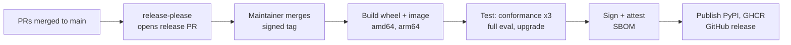

# shoc OSS: PRD and roadmap

As of 2026-09-29 · Owner: Rettila · Status: draft

## Summary

shoc is an open-source, headless, AI-first SOC for companies of 20–500 people that have no security team. A crew of agents monitors, investigates, responds, hunts and keeps the pipeline healthy 24/7, and a human approves risky actions from Slack or any MCP client. This PRD covers the open-source project only: Apache 2.0, one container image plus Postgres, v1.0 targeted for June 2027. A managed SaaS comes later and must build on the OSS contract without changing it.

**The problem**

- Small companies run on AWS, Okta or Entra, Google Workspace or M365, and GitHub, and get attacked through them: leaked keys, MFA fatigue, OAuth app abuse, public repos.
- They can't staff a 24/7 SOC. Commercial MDR and SIEM tools are priced for larger teams, and open-source SIEMs still need analysts to run them.
- LLM agents can now do much of L1–L2 work when every verdict must cite evidence and every action goes through a policy.
- Many teams already use AI assistants that speak MCP. A SOC those assistants can drive directly beats yet another dashboard.

## Goals, non-goals and success metrics

The OSS project succeeds when a small team can go from `docker compose up` to a contained real incident without hiring anyone, and when outside contributors ship connectors and rules without asking us.

**Goals**

1. A self-hosted, 24/7 agentic SOC that one engineer can install in under an hour.
2. A headless kernel: every capability usable from REST, MCP, CLI and Slack, with no required UI.
3. Trustworthy agents: cited evidence, bounded autonomy, full audit, public eval results.
4. A composable event store: Postgres, Databricks SQL, Snowflake, Redshift or BigQuery behind one adapter.
5. A healthy project: clear governance, predictable releases, secure supply chain, easy first contributions.

**Non-goals for the OSS project**

- Multi-tenant hosting, billing or a tenant control plane. Those belong to the future SaaS.
- An endpoint agent, network sensors, on-prem or OT sources.
- A visual playbook builder or a full SIEM search UI.
- Fully autonomous response. A human always approves L2 actions.
- A human MDR service.

**Success metrics at v1.0**

| Area | Metric | Target |
| --- | --- | --- |
| Time to value | Install to first real finding | Under 60 min |
| Quality | Investigator verdict accuracy on the public eval set | 85% or more |
| Quality | Verdicts with valid citations | 99% or more |
| Noise | Human-actionable cases per day, 100-person company | Under 5 |
| Portability | Conformance suite passing on all 3 backends | 100% |
| Adoption | Production installs that opt in to anonymous telemetry | 100 |
| Community | Contributors with a merged PR | 30, at least 10 outside the core team |
| Community | Connectors or rule packs from outside contributors | 10 |
| Health | Median time to first response on issues and PRs | Under 3 business days |
| Security | OpenSSF Scorecard score | 8 or more |

The adoption and community targets are first guesses to set a direction. Revisit them at v0.3.

## Users and use cases

The primary user is the one engineer who owns security by default. Everyone else reaches the product through tools they already use.

| Persona | Who | What they need | Main interface |
| --- | --- | --- | --- |
| Accidental security owner | DevOps, SRE or IT lead at a 20–500 person company | Install it, trust it, get paged only when it matters | Slack, CLI |
| On-call approver | Engineer or founder on rotation | Understand a case in 60 seconds, approve or reject | Slack, phone |
| AI-assistant user | Anyone using Claude, ChatGPT or Cursor | Ask questions and run hunts in plain language | MCP client |
| Detection engineer | Part-time or consultant | Write rules and playbooks as code, test them, ship them | Git, CLI |
| Contributor | Community developer or vendor | Add a connector, rule pack or backend adapter quickly | Repo, SDK docs |
| MSSP / partner | Small security provider | Run it for several clients, add human L3 | REST, MCP |

**Core use cases for v1.0**

1. Detect and contain a leaked cloud key, from the event to a disabled key and a page, in under 10 minutes.
2. Stop an MFA-fatigue or session-hijack attempt on an identity provider account.
3. Find and revoke a malicious OAuth app with access to Google Workspace or M365.
4. Ask "what happened with X?" from Slack or Claude and get a cited answer.
5. Run hunts, and have the detections they justify written, tested and merged.
6. Get alerted when a source goes silent, a rule gets noisy or spend nears its budget.
7. Be told when something genuinely needs a decision, and otherwise read one weekly report without opening any UI.

## Product requirements

v1.0 ships 45 requirements across eight areas (AGT-7 was removed). Each has a stable ID so issues, PRs and release notes can reference it. The target column is what the roadmap below commits to.

| ID | Requirement | Target |
| --- | --- | --- |
| ING-1 | Pull connectors for the sources a small company actually runs on, with cursors that survive restarts: identity (Okta, Entra ID, Google Workspace), productivity (M365, Google Workspace), EDR alerts (Defender, CrowdStrike, SentinelOne) and, as separate sources, their telemetry (Advanced Hunting, Falcon Data Replicator, Cloud Funnel), cloud control planes (AWS CloudTrail and GuardDuty, Azure Activity Log, GCP Cloud Audit) and source control (GitHub, GitLab); and, for teams whose plans have no enterprise audit API, the accounts they run on (Cloudflare, Tailscale, Stripe) and Cloudflare's Logpush traffic and Zero Trust logs, usage per model API key (OpenAI, Anthropic), and GitHub's organisation webhook | v0.1 (AWS, Okta, GitHub), v0.2 (rest) |
| ING-2 | A vendor's push, taken as the vendor sends it and checked with the vendor's own signature (GitHub's organisation webhook); every other source is read the way its vendor documents for a SIEM | v0.2 |
| ING-3 | OCSF 1.x mappings as versioned YAML, with fixtures and tests per source | v0.1 |
| ING-4 | Connector SDK: a new source in one Python module + one mapping file | v0.2 |
| STO-1 | `EventStore` adapter interface with a public conformance suite | v0.1 |
| STO-2 | Postgres adapter: partitions, retention, COPY loading | v0.1 |
| STO-3 | Databricks SQL adapter: UC Volume staging, COPY INTO | v0.2 |
| STO-4 | Snowflake adapter: internal stage, COPY INTO | v0.4 |
| STO-5 | Amazon Redshift adapter: S3 staging, COPY, insert-only load | After v1.0 |
| STO-6 | Google BigQuery adapter: load job into a staging table, insert-only MERGE | After v1.0 |
| DET-1 | Sigma-subset compiler to canonical SQL, translated per dialect with SQLGlot | v0.1 |
| DET-2 | 50 curated rules mapped to ATT&CK, each with a positive and a negative test | v0.1 (20), v0.3 (50) |
| DET-3 | Scheduler on Postgres: 5-minute cycles, correlation, deduplication | v0.1 |
| DET-4 | Threat-intel indicators from polled sources (abuse.ch, OTX, MISP, any indicator list URL; no CISA KEV, D57; URLhaus without payloads for embedded devices, D122) or handed in and withdrawn (`intel.add`, `intel.remove`, D59), with IOC matching and 90-day retro-hunt | v0.3 |
| DET-6 | `intel.lookup`: on-demand indicator research across downloaded lists, keyless sources, keyed sources a person configured under a daily quota (D123) and our own history, scored and cached | v0.3 |
| DET-7 | `intel.digest`: read a threat report (URL, text or PDF) into indicators, ATT&CK techniques and hunts; report sources (RSS or Atom, OTX pulses, MISP events) are polled, scored against what the company runs, and read best-first under a daily cap (D59, D122) | v0.3 |
| DET-8 | Hunt packs: behavioural hunts as reviewed YAML content, with `first_seen` and `rare` baselines and fixtures | v0.3 |
| DET-9 | Daily hunt cycle: every due pack on ready data runs over what was ingested since its last window, ordered by the hypotheses intel raised, then by intel and case techniques, under a budget (RFC 0022, D132) | v0.3 |
| DET-11 | Hunt outcome contract: `clear`, `explained`, `inconclusive`, `suspicious`, `gap`, each routed; a pack that cannot be answered is not applicable or learning, and records no run (RFC 0022) | v0.3 |
| AGT-1 | Openspace: typed messages, rounds, token and time budgets, LISTEN/NOTIFY | v0.2 |
| AGT-2 | Roles: Sentinel, Investigator, Challenger, IR Commander | v0.2 |
| AGT-3 | Roles: CTI, Hunter, Detection Engineer, Surveyor, Ops, Reporter (the SOC Manager since AGT-14) | v0.3 |
| AGT-4 | World graph and memory (episodic, semantic) in Postgres with full-text search | v0.3 |
| AGT-5 | LLM clients for Anthropic and any OpenAI-compatible endpoint, including local models | v0.2 |
| AGT-6 | Public eval harness replaying attack simulations, with results published per release | v0.2 |
| AGT-7 | Weekly attack rehearsal with adversary personas on a read-only graph snapshot | Removed (D54) |
| RSP-1 | Case engine with NIST 800-61 states | v0.2 |
| RSP-2 | Playbook runner: idempotent steps, timers, approvals, retries | v0.3 |
| RSP-3 | Autonomy policy in YAML (L0, L1, L2); L2 needs a human principal | v0.3 |
| RSP-4 | Actions: disable key, suspend user, revoke sessions, isolate host, make repo private, block IP; every platform shoc ingests from has response actions and live lookups of its own (D56); an action acts in the tenant its target was seen in, with that tenant's credential (D116) | v0.3 |
| RSP-5 | Research before blocking: no automatic action against an unresearched target, shared infrastructure or our own egress | v0.3 |
| RSP-6 | Peer review before blocking: the IR Commander reviews a containment action and cites its blast radius (D45); any objection escalates it to a human | v0.3 |
| API-1 | Capability registry that generates REST + OpenAPI, MCP tools and CLI commands | v0.1 |
| API-2 | Event stream: SSE and signed webhooks | v0.2 |
| API-3 | Slack app: alerts, `ask`, one-click approvals | v0.3 |
| API-4 | Config as code: `shoc plan` / `shoc apply` for rules, playbooks, policies | v0.4 |
| OPS-1 | Source health and *quality* (completeness, retention, timeliness, field fidelity), rule health, the metric set (MTTD/MTTR per incident type), cost and LLM spend | v0.3 |
| AGT-8 | Posture from ingested events: the Surveyor answers what exists, what is exposed, who is privileged and what nothing watches | v0.3 |
| AGT-9 | Peer talk: a role calls another role while it is thinking and gets the answer inside its own turn, with the exchange recorded in the openspace | v0.4 |
| AGT-10 | Agents call read capabilities while they investigate, through the registry, with what they looked up recorded on what they said | v0.4 |
| AGT-11 | A specialist is called by the case's own evidence: observables extracted from the events, and CTI a peer the Investigator asks while it forms a view (D41) | v0.4 |
| AGT-12 | Resumable cases: the crew returns to any open case with a new finding, a completed action or an injected fact, and continues the discussion | v0.4 |
| RSP-7 | Unattended operation: the crew's proposals reach the policy, approved actions run, and nothing rests on a human arriving: every L2 carries a fallback and a window, every case carries a deadline, and a waiting approval pages or is abandoned with a reason | v0.4 |
| AGT-13 | Roles redefined (RFC 0012): Sentinel shapes cases and defers rather than drops, no role may choose `needs_human`, the Challenger argues either side, the Commander owns the outcome and cites its blast radius, the Surveyor answers what a target is to us, the Integrator onboards a source until it produces a finding, and every crew role uses a model | v0.4 |
| AGT-14 | The SOC Manager is the operator's one contact (RFC 0015): every page, Slack message and report goes through it, a query decides one page per incident, and `ask` is answered by the Manager calling the crew | v0.4 |
| SEC-1 | Postgres row-level security, encrypted secrets, read-only agent role, hash-chained audit log | v0.1 (audit), v0.3 (rest) |
| SEC-2 | Prompt-injection defense: log content quoted as data, uncited verdicts downgraded | v0.2 |
| SEC-3 | People sign in with email, password and an authenticator code, or the company's OIDC provider; sessions are revocable rows (RFC 0028) | v0.4 |

## Architecture principles

These principles are binding for every PR. Changing one needs an RFC. The full design is in `docs/architecture.md`.

1. **Headless first.** Every feature starts as a capability in the registry: typed input and output, scope, autonomy level. REST, MCP, CLI and Slack are generated from it. A UI is always an optional client.
2. **AI-first.** Agents use the same capabilities as people. Every answer is JSON plus a short summary plus citations. "Ask" is a first-class call.
3. **Minimal dependencies.** Postgres is the only required service. A new dependency must be a library, not a service, and must replace code we would otherwise maintain. Core stays at 8 Python packages or fewer.
4. **Composable event store.** Nothing in the core uses a warehouse-specific feature. Canonical SQL over OCSF, translated per dialect. Every adapter passes the same conformance suite.
5. **Bounded autonomy.** Agents read; the playbook runner acts. Every action is typed, checked against policy, reversible or human-approved, and audited.
6. **Evidence or nothing.** A verdict without cited event IDs becomes "needs human". Log content is always treated as untrusted data.
7. **SaaS-ready, not SaaS-shaped.** Tenant ID lives in every table and every call from day one, so the SaaS can reuse the kernel without forking it.

## Open source model

The kernel is Apache 2.0 and stays that way. The future SaaS sells operations (hosting, scale, support), not features taken out of the OSS.

**License and contributions**

- **License:** Apache 2.0 for all code, rules, playbooks and docs. It includes a patent grant and is easy for companies to approve. AGPL would protect better against a cloud provider reselling it, but it slows adoption by small companies and partners.
- **Contributions:** DCO sign-off (`git commit -s`), no CLA. This keeps friction low. The trade-off: we can't relicense contributed code later, so the SaaS must never need to.
- **Third-party code:** only licenses compatible with Apache 2.0, checked in CI. A `NOTICE` file lists attributions.

**Governance**

- Starts as a maintainer-led project, with `GOVERNANCE.md` describing three roles: contributor, reviewer, maintainer. Promotion is based on sustained, merged work and a vote of existing maintainers.
- Day-to-day decisions use lazy consensus in PRs. Changes to the architecture principles, public API or security model need an RFC in `rfcs/`, open for at least 7 days.
- Aim to have maintainers from at least two organizations by v1.0. After v1.0, consider moving to a neutral foundation.
- **Trademark:** register the final name and publish `TRADEMARKS.md`. Forks may use the code but not the name or logo.

**Open-core boundary**

| Always open source | Future SaaS only |
| --- | --- |
| Kernel, capability registry, REST, MCP, CLI, event stream | Multi-tenant control plane: tenants, billing, quotas |
| All connectors, backend adapters and OCSF mappings | Managed hosting, upgrades, backups and SLA |
| All agents, rules, hunts and playbooks | Hosted console with SCIM provisioning for teams |
| Slack app, autonomy policy, audit log | Managed LLM endpoint and spend controls across tenants |
| Sign-in: email, password and authenticator, or OIDC SSO | Compliance evidence exports (SOC 2, ISO 27001) |
| Eval harness and published results | 24/7 human escalation partners |

Public promise, written in the README: no feature will move from the open-source project to the paid offer.

## Repository management

One monorepo on GitHub, trunk-based, with every protection and check automated from day one. It's cheaper to start strict than to tighten later.

**Repos in the GitHub organization**

| Repo | Contents | Why separate |
| --- | --- | --- |
| `shoc` | Kernel, CLI, connectors, adapters, agents, content (rules, hunts, playbooks), evals, docs, deploy, and the optional console under `console/` | One version, one CI, atomic changes across layers |
| `.github` | Org-wide issue templates, `CODE_OF_CONDUCT.md`, `SECURITY.md`, funding | GitHub applies them to every repo |

Split content into its own repo only if rule packs need to ship faster than the kernel after v1.0.

**Files required before the first public commit**

- `README.md` (what, quick start, status, the no-feature-removal promise), `LICENSE`, `NOTICE`
- `CONTRIBUTING.md` (dev setup in under 10 minutes, DCO, commit style, how to add a connector or rule)
- `CODE_OF_CONDUCT.md` (Contributor Covenant 2.1), `SECURITY.md`, `SUPPORT.md`
- `GOVERNANCE.md`, `MAINTAINERS.md`, `CODEOWNERS`, `rfcs/0000-template.md`
- Issue forms: bug, feature, connector request, rule request. A PR template with a checklist.

**Workflow**

- Trunk-based on `main`. Short-lived branches, squash merge, linear history, no force push.
- PR titles follow Conventional Commits (`feat(connector): add okta system log`); they drive the changelog.
- Rulesets on `main`: 1 maintainer approval; 2 for security-sensitive paths set in CODEOWNERS (`agents/`, `cases/policy`, `actions/`, `auth`); all checks green; DCO passing.
- Release branches `release/0.N` exist only to backport patches.
- Labels: `kind/*`, `area/*`, `priority/*`, `good first issue`, `help wanted`, `needs-rfc`. A weekly triage rotation among maintainers. GitHub Discussions for questions and ideas.

**Continuous integration (GitHub Actions)**

| Check | When | Blocks merge |
| --- | --- | --- |
| Lint and format (ruff), types (pyright) | Every PR | Yes |
| Unit tests, rule tests (positive and negative fixtures) | Every PR | Yes |
| Conformance suite on Postgres (service container) | Every PR | Yes |
| Conformance suite on Databricks SQL, Snowflake, Redshift and BigQuery | Nightly and on release, maintainers' credentials, never on fork PRs | Release only |
| Agent eval smoke test (small replay set) | PRs touching `agents/` or `content/` | Yes |
| Full agent eval, results published | Nightly and on release | Release only |
| Dependency budget (core packages 8 or fewer), license compatibility | Every PR | Yes |
| Docs build and link check | Every PR | Yes |

**Supply-chain and repo security**

- Private vulnerability reporting on; a 90-day coordinated disclosure policy in `SECURITY.md`.
- CodeQL, secret scanning with push protection, Renovate for dependencies (grouped, weekly).
- OpenSSF Scorecard action, with its badge in the README.
- Actions pinned to commit SHAs, least-privilege `GITHUB_TOKEN`, no `pull_request_target` with checkout of fork code.
- 2FA required for the org. Maintainers sign release tags.

## Release management

Releases are time-based, automated from Conventional Commits, and signed. Every release publishes its conformance and eval results next to the changelog.

**Versioning**

- Semantic Versioning. During 0.x, a minor release may break things, but each break is listed with upgrade steps.
- From 1.0, the **public contract** only breaks in a major release: REST `/v1`, MCP tool names and schemas, capability schemas, event types, the `EventStore` interface, OCSF table layout, and the YAML formats for rules, playbooks and policies.
- Content (rules, hunts, playbooks) ships with the kernel and follows its version.

**Cadence and channels**

| Channel | What | How often |
| --- | --- | --- |
| Edge | Image built from `main`, tag `:edge` | Every merge |
| Release candidate | `vX.Y.0-rc.N`, feature-frozen | 1 week before each minor |
| Stable minor | `vX.Y.0` | Every 6–8 weeks |
| Patch | `vX.Y.Z`, fixes only | As needed |
| Security | Out-of-band patch + GitHub security advisory | Within 7 days of a confirmed high or critical issue |

**Pipeline**

Nothing publishes unless the conformance suite passes on Postgres, Databricks SQL and Snowflake and the upgrade test from the previous minor passes.

**Artifacts**

- PyPI package `shoc` with extras `[databricks]`, `[snowflake]` and `[pdf]`, published with Trusted Publishing (no long-lived tokens) and attestations.
- Multi-arch OCI image on GitHub Container Registry, signed with Sigstore cosign (keyless) and with build provenance.
- CycloneDX SBOM attached to each release.
- `docker-compose.yml` in every release; a Helm chart from v0.4.

**Upgrades, deprecation and support**

- Database migrations are forward-only and run with `shoc migrate`. CI tests the upgrade from the previous minor on every release.
- A deprecated field, capability or config key warns for at least 2 minor releases before removal.
- The latest two minor releases get security fixes. After 1.0, one release per year may be marked LTS if users ask for it.

**Release checklist**

- [ ] RC cut and announced in Discussions
- [ ] Conformance green on Postgres, Databricks SQL and Snowflake
- [ ] Full eval run; scores in the release notes
- [ ] Upgrade test from the previous minor green
- [ ] Notes include highlights, breaking changes, upgrade steps and eval scores
- [ ] Tag signed, artifacts signed and attested, SBOM attached
- [ ] Docs versioned and announcement posted

## Community, docs and adoption

Adoption comes from a fast first run and from contributions that are easy to make: a connector, a rule or a playbook, each with a template and tests.

**Documentation (in `docs/`, versioned per release)**

- Quick start: `docker compose up`, connect one source, connect Claude over MCP, see a first finding.
- Guides: each connector, each backend, Slack setup, autonomy policy, writing rules, writing playbooks.
- Reference, generated from the registry: every capability, REST endpoint, MCP tool and event type.
- Concepts: openspaces, memory, the security model, the eval method.
- Contributor guides: add a connector, add a rule, add a backend adapter, add an agent tool.

**Contributor funnel**

- 20 or more `good first issue` items open at any time, each with the files to touch and a test to write.
- Templates and generators: `shoc new connector`, `shoc new mapping`, `shoc new rule`.
- Maintainers aim to answer every first-time contributor within 2 business days.
- Recognition: contributors in release notes and `CONTRIBUTORS.md`; regular connector and rule authors get reviewer rights for their area.

**Channels**

- GitHub Discussions for questions, ideas and RFC talk; Issues for confirmed bugs and planned work.
- One real-time chat (Discord or Slack) linked from the README, once there is enough traffic to staff it.
- Monthly community call after v0.3, with notes posted in Discussions.
- Public roadmap as a GitHub Project board, tied to milestones.

**Telemetry**

- Off by default, opt-in at install. Anonymous: version, backend type, number of sources, feature flags used. No event data, no tenant names.
- The payload schema is documented, and `shoc telemetry show` prints exactly what would be sent.

## Roadmap

Five releases take the project from an empty repo to v1.0 by 2027-06-30, one theme per release. The repo is public from Phase 0; the launch announcement waits for v0.1. The SaaS track starts only after v1.0 and runs on the same kernel.

| Release | Target | Theme | Scope (requirement IDs) | Exit criteria |
| --- | --- | --- | --- | --- |
| Phase 0 | 2026-10-31 | Foundations | Repo, governance files, CI, rulesets, security settings, RFCs for registry, adapter and openspace protocol | All required files merged; CI and Scorecard green; 3 RFCs accepted |
| v0.1 | 2026-12-15 | Kernel | API-1, STO-1, STO-2, ING-1 (AWS, Okta, GitHub), ING-3, DET-1, DET-2 (20 rules), DET-3, SEC-1 (audit) | Leaked-key scenario detected end to end on Postgres; findings queried from Claude over MCP |
| v0.2 | 2027-02-15 | Crew | AGT-1, AGT-2, AGT-5, AGT-6, RSP-1, STO-3, ING-1 (rest), ING-2, ING-4, API-2, SEC-2 | Investigator accuracy 80% or more on the public eval; conformance green on Postgres and Databricks SQL |
| v0.3 | 2027-04-15 | Response | RSP-2, RSP-3, RSP-4, RSP-5, RSP-6, AGT-3, AGT-4, AGT-8, DET-2 (50 rules), DET-4, DET-6, DET-7, DET-8, DET-9, DET-11, API-3, OPS-1, SEC-1 (rest) | 3 design partners running 24/7 for 4 weeks; leaked key contained in under 10 min, and no automatic block lands on shared infrastructure |
| v0.4 | 2027-05-31 | Freeze | STO-4, AGT-9, AGT-10, AGT-11, AGT-12, AGT-13, AGT-14, API-4, RSP-7, SEC-3, Helm chart; public contract documented and frozen | Conformance green on all 3 backends; no contract changes during the RC; a leaked key is contained end to end with nobody logged in |
| v1.0 | 2027-06-30 | Stable | Hardening, docs, third-party security review of agents, policy and actions | Every v1.0 success metric met or waived by the maintainers in writing |

**Where the code is against this plan**

The code covers the scope through v0.4, and nothing has been released; the
version is still `0.0.1`. The capability reference in
[`reference.md`](reference.md) and the contract snapshot in
[`contract/v1.json`](https://github.com/pwnera/shoc/blob/main/contract/v1.json) are generated from the code and list
what exists.

The open scope found by the audits of 2026-09-27 and 2026-09-29 was closed on
2026-10-03, and the decisions it forced are D88–D115. What stays open is what
code cannot close: accounts we do not have, limits of the vendors' APIs, and
repository settings.

| ID | Open |
| --- | --- |
| STO-3, STO-4, STO-5, STO-6, DET-1, DET-3 | The Databricks, Snowflake, Redshift and BigQuery load paths, their DDL, the compiled rules and the bucket-by-bucket cycle have never run on a real warehouse. The CI job that runs them skips without warehouse credentials, and none are configured. Redshift and BigQuery have no unit tests yet, and the rules with a `sequence` or `first_seen` correlation use a correlated subquery with a time range, which both warehouses may refuse to decorrelate |
| ING-1 | Every Entra sign-in comes from the Graph beta endpoint, the only one that serves non-interactive, service principal and managed identity sign-ins and the user agent of interactive ones, which Microsoft does not support for production. Wazuh is read only when shoc can reach the indexer, port 9200 by default |
| ING-1 | The Stripe activity log is a public preview with no time filter, pinned here to `2026-07-29.preview`, and Stripe's own takeover signals (logins, bank account and payout changes) are not in it |
| ING-2 | A GitHub organisation webhook carries no source address and no event time, and GitHub sends none for an owner promotion (`org.update_member`), an app installed on the organisation, or a change to the webhook short of its deletion |
| DET-4 | `md5` and `cve` indicators have no event column to match, so they are stored and never matched |
| DET-8 | The packs with a 30-day lookback on Google Workspace, Tailscale, Cloudflare and GitHub are learning until their sources have 30 days of history |
| RSP-4 (D56) | Cloudflare is ingested, but no playbook uses `cloudflare.block_ip`: the account rules name no attacker address, and a Gateway rule's address is the company's own device. Stripe cannot revoke a key, remove a member or hold payouts through its API, and OpenAI can delete a key (L2) or throttle its project, so a Stripe takeover ends in a page and an OpenAI one in a throttle or an L2 approval |
| RSP-6 | An L1 playbook step on a target that is not blocked (a key, a user) is never reviewed |
| AGT-13 | Four tools the role specs name do not exist yet (`roles.NOT_BUILT`): `evidence.preserve`, `indicator.exclude`, `budget.get` and `budget.set` |
| AGT-13 (D78) | On Tailscale, whose log carries no address, matching shoc's own token requests by time is the only test |
| DET-11 | Hunt metrics count open backlog items as `gaps_open` and count every hunt promotion in any state with no window, and readiness checks the product but not whether a pack's fields arrive: a GitHub pack turns ready on 2026-11-01 over events whose source address is always empty |
| OPS-1 | Time to contain counts dry-run actions and page steps as containment |
| RSP-7 | `SHOC_DRY_RUN=0` does not turn response on: the policy's default `dry_run: true` wins over the environment |
| Phase 0 | CodeQL and Scorecard skip while the repository is private; rulesets, 2FA, private vulnerability reporting, secret scanning and Renovate are repository settings not yet set. The release workflow has had no `0.0.1` dry run |

Both v0.1 exit criteria are met in CI. `tests/test_scenarios.py` replays the
leaked-key scenario through detection on Postgres, and
`tests/conformance/test_rest.py` queries the replay's findings with the MCP
`finding_list` tool over HTTP.

Exit criteria still unverified, and what they need:

| Criterion | Needs |
| --- | --- |
| Investigator accuracy ≥ 80% on the public eval (v0.2) | An LLM key (`SHOC_LLM_API_KEY` for the Evals workflow). `python -m evals.run --investigate` scores it; a crew that calls everything malicious scores 64% |
| Conformance green on Databricks SQL and Snowflake (v0.2, v0.4) | Warehouse credentials as CI secrets. The `warehouses` job runs the suite and every rule when they are set |
| Three design partners running 24/7 for four weeks (v0.3) | Design partners |
| Leaked key contained in under 10 minutes (v0.3) | A real tenant. In the replayed scenario the containment playbook completes without waiting for anyone, and a crew-proposed `aws.disable_access_key` names the key's user |
| Third-party security review (v1.0) | A reviewer. `docs/security-model.md`, RFC 0024 and the registry-wide invariants in `tests/unit/test_security_invariants.py` are what they would start from |

**After v1.0 (second half of 2027)**

- OSS: more connectors, Redshift and BigQuery conformance green (STO-5, STO-6; the adapters are wired, D131), console 1.0, calling external MCP tools from the crew, an LTS release if users ask for it, and a foundation decision.
- SaaS: multi-tenant control plane and managed hosting on AWS with Databricks SQL Serverless, built as a separate product on top of released OSS versions.

**Phase 0: first 30 days**

- [ ] Confirm the final name (shoc), check the trademark, register the domain and GitHub org
- [x] Create the monorepo with all required community files and `GOVERNANCE.md`
- [ ] Turn on rulesets, 2FA, private vulnerability reporting, CodeQL, secret scanning, Renovate, Scorecard
- [x] CI skeleton: ruff, pyright, tests, DCO, dependency budget, license check
- [ ] Set up release-please, PyPI Trusted Publishing and GHCR publishing on a `0.0.1` dry run
- [x] Write the three foundation RFCs: capability registry, `EventStore` adapter, openspace protocol
- [x] Seed 20 `good first issue` items (`docs/good-first-issues.md`)
- [ ] Publish the roadmap board

## Risks and open questions

The biggest risk is trust: a wrong verdict or a bad automatic action early on would cost more adoption than any missing feature.

| Risk | Impact | Mitigation |
| --- | --- | --- |
| Agent gives a confident wrong verdict | Users stop trusting it, or miss a real incident | Required citations, Challenger role, public evals per release, human approval for L2 |
| Harmful automatic action | Production outage at a user's company | L1 limited to reversible actions, per-action policy, dry-run mode by default for new installs |
| Prompt injection through log content | Agent manipulated by an attacker | Logs quoted as data, typed tools only, read-only agent role, red-team evals |
| Lowest-common-denominator SQL is slow on Postgres | Poor experience at higher volume | Documented volume limits per backend; per-dialect overrides allowed inside adapters |
| LLM costs too high for small users | Users switch it off | Round and token budgets, cheap models for L1 roles, local model support |
| Maintainer burnout | Slow reviews, contributors leave | Triage rotation, strict scope, second-organization maintainers by v1.0 |
| A cloud provider or vendor resells it | SaaS revenue at risk | Trademark policy; compete on operations and speed of content, not on license |

**Open questions**

- [ ] Final project name and trademark availability (working name: shoc)
- [ ] Apache 2.0 or AGPL for the kernel (this draft assumes Apache 2.0)
- [ ] Which 3 design partners, and on which backend each
- [ ] Default LLM for the quick start: a hosted API or a local model
- [ ] Does the console ship in 2027, or do Slack and MCP clients cover v1.0 users
- [ ] Foundation timing: after v1.0, or only once a second organization maintains the project
